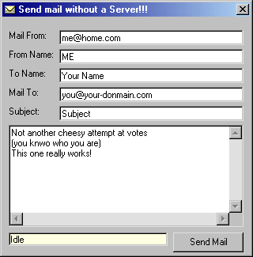



## SendMail Without Server

### Description

Send emails without having to have a mail server.

 

Forgive me if you think this demonstration is pathetic...

This is really intended for beginners, and I know there are some out there

asking how to do this.

 

If you use any of this code, please give them credit.

 

This is just a simple program that shows how to send an email

without having an email server at your disposal.

 

To use, simply enter the Mail From, From Name, Mail To, and Subject, and Message.

 

How does this work?

Simple - it first takes the domain from the email you are sending to...

So if you are sending to a@b.com the domain is b.com

 

It then does an MX Lookup to find the mail server for that domain (mail.b.com)

Then it sends the email to the server.

 
 
### More Info
 
Lots of losers will build email flooding programs from this.

             |
---                |---
**Submitted On**   |2001-11-09 18:23:26
**By**             |[Bryan A\. Cairns](https://github.com/Planet-Source-Code/PSCIndex/blob/master/ByAuthor/bryan-a-cairns.md)
**Level**          |Beginner
**User Rating**    |4.3 (113 globes from 26 users)
**Compatibility**  |VB 5\.0, VB 6\.0
**Category**       |[Complete Applications](https://github.com/Planet-Source-Code/PSCIndex/blob/master/ByCategory/complete-applications__1-27.md)
**World**          |[Visual Basic](https://github.com/Planet-Source-Code/PSCIndex/blob/master/ByWorld/visual-basic.md)
**Archive File**   |[SendMail\_W342761192001\.zip](https://github.com/Planet-Source-Code/bryan-a-cairns-sendmail-without-server__1-28784/archive/master.zip)

### API Declarations

A few - see zip

